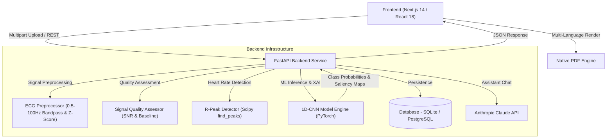

<div align="center">
  
  

  # Cardiosense AI
  **Clinical Cardiac Signal Screening & Explainability Platform**
  
  <p align="center">
    <a href="https://nextjs.org/"></a>
    <a href="https://reactjs.org/"></a>
    <a href="https://tailwindcss.com/"></a>
    <a href="https://www.typescriptlang.org/"></a>
    <br/>
    <a href="https://fastapi.tiangolo.com/"></a>
    <a href="https://pytorch.org/"></a>
    <a href="https://www.sqlalchemy.org/"></a>
    <a href="https://www.python.org/"></a>
  </p>

</div>

---

## 📖 Overview

**Cardiosense AI** is a production-grade, AI-assisted research and clinical screening system designed to democratize cardiac health monitoring. By analyzing complex electrophysiological (ECG) and optical (PPG) waveforms, our platform provides rapid, explainable risk stratification, signal quality metrics, R-peak heart rate estimation, and automated doctor review workflows.

---

## 🚀 Key Features

* **⚡ Real-Time Signal Analysis**: Upload raw CSV/TXT/EDF clinical waveform data (ECG/PPG) for instant cardiovascular classification using deep 1D Convolutional Neural Networks.
* **🧠 Explainable AI (XAI)**: Saliency-based gradient backpropagation heatmaps identify the exact temporal regions of the cardiac waveform that influenced the AI model's prediction.
* **📊 Signal Quality Assessment**: Automated SNR noise evaluation, baseline drift analysis, and saturation detection computing a composite 0–100 quality score (`GOOD`, `MODERATE`, `POOR`).
* **🌍 Multi-Language PDF Reporting**: Generate formal clinical reports in multiple regional languages (English, Hindi, Tamil, Telugu, Gujarati, Marathi, Bengali) using a native PDF rendering engine.
* **👨‍⚕️ Role-Based Portals**: Tailored dashboards for Patients, Doctors, and Administrators with patient cohort tracking, clinical assessment submission, and system metrics.
* **🤖 CardioAI Assistant**: Integrated AI assistant powered by Claude (with fallback support) for explaining screening results in user-friendly language.
* **🔬 Modular ML Pipeline**: Standalone PyTorch training and evaluation pipeline with patient-level splitting, data augmentation, and model version registry.

---

## 🏗 System Architecture



---

## 🔌 API Specifications & Endpoint Registry

All backend routes are exposed under `/api` and return standardized JSON responses matching the frontend TypeScript contracts.

| Endpoint | Method | Role | Description |
| :--- | :---: | :---: | :--- |
| `/health` | `GET` | Public | System health check & demo status |
| `/api/auth/register` | `POST` | Public | Register user & return JWT token |
| `/api/auth/login` | `POST` | Public | Authenticate user & return JWT token (auto-demo mode) |
| `/api/auth/logout` | `POST` | Public | End user session |
| `/api/analysis/upload` | `POST` | User | Upload & analyze raw ECG/PPG CSV/TXT file |
| `/api/analysis/history` | `GET` | User | Get paginated analysis history |
| `/api/analysis/{id}` | `GET` | User | Fetch single analysis record details |
| `/api/analysis/{id}` | `DELETE` | User | Soft-delete an analysis record |
| `/api/users/me` | `GET` | User | Fetch active user profile |
| `/api/users/me` | `PUT` | User | Update user profile details |
| `/api/doctor/patients` | `GET` | Doctor | Get doctor's assigned patient cohort & latest analyses |
| `/api/doctor/review/{id}` | `POST` | Doctor | Submit doctor assessment & notes |
| `/api/admin/stats` | `GET` | Admin | Get platform statistics & classification breakdown |
| `/api/admin/models` | `GET` | Admin | List registered model versions |
| `/api/admin/models/{v}/promote` | `POST` | Admin | Promote model version to production |
| `/api/chat` | `POST` | User | Interact with CardioAI Assistant |

---

## 🧠 ML Model & Signal Processing Specs

### 1D Convolutional Neural Network (PyTorch)
```
Input: ECG Tensor (batch, 1, 3600)  [10 seconds @ 360 Hz]
 ├── Conv1D(1 → 64, kernel=5)   → BatchNorm → ReLU → MaxPool1D(2)
 ├── Conv1D(64 → 128, kernel=5) → BatchNorm → ReLU → MaxPool1D(2)
 ├── Conv1D(128 → 256, kernel=5)→ BatchNorm → ReLU → MaxPool1D(2)
 ├── GlobalAveragePooling1D()
 ├── Dense(256 → 128) → ReLU → Dropout(0.5)
 └── Dense(128 → 5)   → Softmax
Output: [P(Normal), P(Bradycardia), P(Tachycardia), P(Irregular Rhythm), P(Other)]
```

### Preprocessing Pipeline
1. **Resampling**: Resamples input signal to standard 360 Hz.
2. **Bandpass Filtering**: 4th-order Butterworth filter (0.5 Hz – 100 Hz).
3. **Baseline Drift Removal**: High-pass filter at 0.5 Hz to eliminate movement artifacts.
4. **Z-score Normalization**: Zero mean, unit variance.
5. **Windowing**: Padded or truncated to 3,600 samples.

---

## ⚙️ Installation & Setup

### Prerequisites
- **Node.js**: v18.0+
- **Python**: v3.10+
- **Git**

### 1. Clone the repository
```bash
git clone https://github.com/Tusharjain-19/cardiosense_ai.git
cd cardiosense_ai
```

### 2. Backend Setup (FastAPI & Python)
```bash
cd backend

# Create virtual environment
python -m venv venv

# Activate virtual environment
# Windows:
venv\Scripts\activate
# Linux/Mac:
# source venv/bin/activate

# Install dependencies
pip install -r requirements.txt

# Run FastAPI development server
python -m uvicorn app.main:app --reload --port 8000
```
- API Endpoint: `http://localhost:8000`
- Interactive Swagger Docs: `http://localhost:8000/docs`

### 3. Frontend Setup (Next.js 14)
Open a new terminal tab:
```bash
cd frontend

# Install dependencies
npm install

# Run Next.js development server
npm run dev
```
- Web Application: `http://localhost:3000`

---

## 🧪 Testing

The backend includes 32 unit and integration tests covering preprocessing, signal quality, model architecture, and REST API routes:

```bash
cd backend
python -m pytest tests/ -v
```

---

## 📂 Project Structure

```text
cardiosense_ai/
├── frontend/                     # Next.js 14 App Router Application
│   ├── src/
│   │   ├── app/                  # Application pages (Dashboard, Upload, Doctor Portal)
│   │   ├── components/           # UI components, interactive charts & chat
│   │   ├── context/              # State management & i18n localization
│   │   ├── services/             # API communication layer
│   │   └── types/                # Shared TypeScript interfaces
│   └── public/                   # Static assets & sample recordings
│
├── backend/                      # FastAPI Microservice & ML System
│   ├── app/
│   │   ├── main.py               # Application entry point & lifespan manager
│   │   ├── config.py             # Settings & environment configuration
│   │   ├── api/v1/               # REST API endpoints (Auth, Analysis, Doctor, Admin, Chat)
│   │   ├── database/             # SQLAlchemy ORM models, engine & Pydantic schemas
│   │   ├── services/             # Business logic (Auth, Analysis, ML inference)
│   │   ├── ml/                   # Signal preprocessing, quality scoring & XAI
│   │   └── utils/                # JWT security, bcrypt hashing & logging
│   ├── training/                 # Offline ML model training pipeline
│   │   ├── models/cnn_1d.py      # PyTorch 1D CNN architecture
│   │   ├── data/                 # Loader & augmentation transforms
│   │   ├── pipeline/             # Training loop & evaluation suite
│   │   └── scripts/              # CLI training & evaluation commands
│   ├── tests/                    # Pytest test suite (32 unit & API tests)
│   ├── requirements.txt          # API dependencies
│   ├── requirements-ml.txt       # ML training dependencies
│   ├── Dockerfile                # Production Docker setup
│   └── docker-compose.yml        # Docker Compose configuration
│
├── BACKEND_PRD.md                # Product Requirements Document
├── BACKEND_IMPLEMENTATION.md     # Backend Implementation Guide
└── README.md                     # Project Documentation
```

---

## 🐳 Docker Deployment

To run the complete stack using Docker Compose:

```bash
docker-compose up --build
```

---

## 🤝 The Team

| Name | Role | Profile |
| :--- | :--- | :--- |
| **Niranjan K** | Lead Backend & ML Architect | [@Niranjan-png](https://github.com/Niranjan-png) |
| **Tushar Jain** | Lead Frontend & Full-Stack Engineer | [@Tusharjain-19](https://github.com/Tusharjain-19) |

---

## ⚠️ Medical Disclaimer

**Important:** Cardiosense AI is an AI-assisted screening and research prototype. Predictions, quality metrics, and reports generated by this application **do not constitute formal medical diagnosis** or clinical advice. The platform is designed to assist healthcare professionals in signal evaluation, not replace clinical judgment.

---

<div align="center">
  <p>&copy; 2026 Cardiosense AI Team. All rights reserved.</p>
</div>
