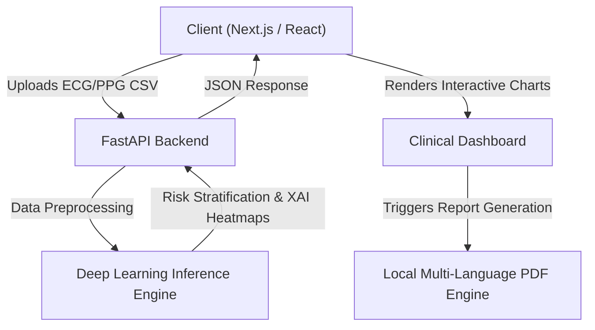

<div align="center">
  
  

  # Cardiosense AI
  **Clinical Cardiac Signal Screening & Explainability Platform**
  
  <p align="center">
    <a href="https://nextjs.org/"></a>
    <a href="https://reactjs.org/"></a>
    <a href="https://tailwindcss.com/"></a>
    <a href="https://www.typescriptlang.org/"></a>
    <br/>
    <a href="https://fastapi.tiangolo.com/"></a>
    <a href="https://www.python.org/"></a>
    <a href="#"></a>
  </p>

</div>

---

## 📖 Overview

**Cardiosense AI** is an advanced, AI-assisted research and clinical screening prototype designed to democratize cardiac health monitoring. By analyzing complex electrophysiological (ECG) and optical (PPG) waveforms, our platform provides rapid, explainable insights and risk stratification, empowering both patients and healthcare professionals.

## 🚀 Key Features

*   **⚡ Real-Time Signal Analysis**: Upload raw CSV/TXT/EDF clinical waveform data (ECG/PPG) for instant cardiovascular analysis.
*   **🧠 Explainable AI (XAI)**: We don't just provide a classification. Our interactive interface highlights the exact segments of the cardiac waveform that the AI model focused on to make its prediction, building clinical trust.
*   **🌍 Multi-Language PDF Reporting**: Generate formal clinical reports in multiple regional languages (English, Hindi, Tamil, Telugu, Gujarati, Marathi, Bengali) using a robust native PDF rendering engine to ensure complex fonts are displayed flawlessly.
*   **👨‍⚕️ Role-Based Portals**: Secure, tailored dashboards for Patients, Doctors, and Administrators to manage recordings and patient cohorts efficiently.
*   **🎨 Stunning UI/UX**: Built with modern web design principles featuring smooth animations, light/dark modes, and interactive elements for a highly premium user experience.

---

## 🏗 Architecture & Flow



---

## ⚙️ Installation & Setup

To run Cardiosense AI locally on your machine, follow these steps.

### 1. Clone the repository
```bash
git clone https://github.com/Tusharjain-19/cardiosense_ai.git
cd cardiosense_ai
```

### 2. Frontend Setup (Next.js)
Ensure you have [Node.js](https://nodejs.org/) installed (v18+ recommended).
```bash
cd frontend
npm install
npm run dev
```
*The frontend will start at `http://localhost:3000`.*

### 3. Backend Setup (FastAPI & Python)
Ensure you have [Python](https://www.python.org/) installed (3.10+ recommended).
```bash
cd backend
python -m venv venv
source venv/bin/activate  # On Windows use `venv\Scripts\activate`
pip install -r requirements.txt
uvicorn main:app --reload
```
*The backend API will start at `http://localhost:8000`.*

---

## 📂 Project Structure

```text
cardiosense_ai/
├── frontend/                 # Next.js 14 App Router
│   ├── src/
│   │   ├── app/              # Page routes (Dashboard, Upload, Doctor Portal)
│   │   ├── components/       # Reusable UI elements & Interactive charts
│   │   ├── context/          # Global State & Language Localization (i18n)
│   │   └── utils/            # Native PDF generation engine & utilities
│   └── public/               # Static assets & Sample clinical recordings
│
├── backend/                  # FastAPI Python Server
│   ├── main.py               # Core API routing
│   └── requirements.txt      # Python dependencies
└── README.md
```

---

## 🛠️ Technology Stack

### Frontend Architecture
*   **Framework**: [Next.js](https://nextjs.org/) (App Router)
*   **Language**: [TypeScript](https://www.typescriptlang.org/)
*   **Styling**: [Tailwind CSS](https://tailwindcss.com/)
*   **Charting**: [Recharts](https://recharts.org/) (Interactive clinical graphs)
*   **PDF Generation**: Native browser rendering via `html2canvas` & `jsPDF` for unparalleled multi-language support.

### Backend Infrastructure
*   **API Framework**: [FastAPI](https://fastapi.tiangolo.com/) (High-performance Python routing)
*   **Language**: [Python 3.10+](https://www.python.org/)
*   **Machine Learning**: Pre-trained deep learning inference algorithms for physiological signal classification.

---

## 🤝 The Team

| Name | Role |
| :--- | :--- |
| **[Niranjan K](https://github.com/Niranjan-png)** | Head of Tech (Backend) |
| **[Tushar Jain](https://tusharjain.in)** | Assistant (Frontend) |

---

## ⚠️ Medical Disclaimer

**Important:** Cardiosense AI is a research and screening prototype. The deep learning models, algorithms, and generated reports provided by this application **do not constitute a formal medical diagnosis**, medical advice, or a definitive clinical evaluation. The system is designed to assist, not replace, certified healthcare professionals. 

If you are experiencing chest pain, shortness of breath, or any medical emergency, please seek immediate medical attention or call your local emergency services.

---

<div align="center">
  <p>&copy; 2026 Cardiosense AI Team. All rights reserved.</p>
</div>
