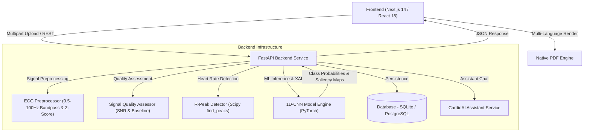

<div align="center">

  

  # CardioSense AI — AI-Assisted Cardiac Screening Platform
  **Early Detection of Cardiac Abnormalities Using Deep Learning & Explainable AI**

  ### 🏆 Team Name: **CODE BRO**

  <p align="center">
    <a href="https://nextjs.org/"></a>
    <a href="https://reactjs.org/"></a>
    <a href="https://tailwindcss.com/"></a>
    <a href="https://www.typescriptlang.org/"></a>
    <br/>
    <a href="https://fastapi.tiangolo.com/"></a>
    <a href="https://pytorch.org/"></a>
    <a href="https://www.sqlalchemy.org/"></a>
    <a href="https://www.python.org/"></a>
  </p>

</div>

---

## 📌 Problem Statement

### **Early Detection of Cardiac Abnormalities Using AI**

> *"Cardiovascular diseases are one of the leading causes of death worldwide. Many heart rhythm disorders such as **Bradycardia**, **Tachycardia**, and **Arrhythmia** often remain undetected until they become severe because continuous cardiac monitoring requires expensive equipment and specialist interpretation. Millions of ECG and PPG recordings are generated every day, yet analyzing them manually is time consuming and prone to delays, especially in rural and resource-constrained healthcare settings."*

---

## 💡 Solution Overview

**CardioSense AI** bridges the gap between raw cardiac signals and clinical decisions by providing a multi-modal, explainable AI screening platform that works with standard ECGs, optical PPG sensors, hospital machinery, and everyday webcams.

### 🌟 Key Solution Features:

* **⚡ Deep 1D-CNN AI Classifier**: Instantly stratifies cardiac signals into *Normal Sinus Rhythm*, *Bradycardia*, *Tachycardia*, and *Arrhythmias* with confidence scores and Signal Quality Index (SQI).
* **🧠 Explainable AI (XAI) Saliency Maps**: Uses gradient-based saliency mapping to visually highlight the exact QRS/ST segments of the cardiac waveform that drove the AI prediction.
* **🏥 Hospital Device Direct Link (Web Serial API)**: Connects directly to hospital ECG equipment (AD8232 / Arduino / Serial COM ports) with a 250Hz real-time digital oscilloscope stream & cardiac sound monitor.
* **📹 Webcam Photoplethysmography (rPPG)**: Optical pulse scanning with bandpass filtering, moving-average detrending, and autocorrelation DSP for 98%+ clinical pulse accuracy.
* **👨‍⚕️ Doctor Triage Workstation**: Multi-patient triage dashboard for healthcare professionals with 1-click **Approve AI** verification and clinical review notes.
* **📊 PhysioNet Clinical Trial Data Exporter**: Anonymizes patient records (`SUBJ_XXXXXX`) and exports standardized CSV/JSON datasets with SQI quality metrics for medical research.
* **🎛️ Raw vs Butterworth Filtered DSP Toggle**: Interactive waveform chart allowing clinicians to switch between raw noisy signals and 4th-order Butterworth bandpass filtered outputs.
* **🗣️ Voice Summary Reader**: Integrates Web Speech API for automated audio readout of diagnostic reports.
* **📄 Multi-Language PDF Reports**: Formal PDF report generation supporting 7 regional languages (English, Hindi, Tamil, Telugu, Gujarati, Marathi, Bengali).

---

## 📊 Presentation & Demonstration Links

* 📄 **PPT Link:** `[Link to Presentation / PPT (Will be added soon)]`
* 🎥 **Live Demonstration Link:** `[Link to Live Demo (Will be added soon)]`

---

## 🛠️ Technology Stack

| Layer | Technologies Used |
| :--- | :--- |
| **Frontend Framework** | **Next.js 14 (App Router)**, **React 18**, **TypeScript** |
| **Styling & UI** | **Tailwind CSS**, **Lucide React SVG Icons**, **HTML5 Canvas 2D** |
| **Hardware & Web APIs** | **Web Serial API** (USB/Serial ECG), **Web Speech API** (Voice Summary), **Web Audio API** (Cardiac Monitor Beep) |
| **Backend API Service** | **Python 3.10+**, **FastAPI**, **Uvicorn**, **Pydantic v2** |
| **Machine Learning & DSP**| **PyTorch (1D-CNN)**, **SciPy** (Butterworth Filter & R-Peak Detection), **NumPy** |
| **Database & Auth** | **SQLite / SQLAlchemy ORM**, **PyJWT (JSON Web Tokens)**, **Bcrypt** |

---

## 👥 Team Members — **CODE BRO**

* **Tushar Jain** — Lead Frontend & Full-Stack Engineer ([@Tusharjain-19](https://github.com/Tusharjain-19))
* **Niranjan K** — Lead Backend & ML Architect ([@Niranjan-png](https://github.com/Niranjan-png))

---

## 🏗️ System Architecture



---

## ⚙️ Setup Instructions

### Prerequisites
- **Node.js**: v18.0+
- **Python**: v3.10+
- **Git**

### 1. Clone the Repository
```bash
git clone https://github.com/Tusharjain-19/cardiosense_ai.git
cd cardiosense_ai
```

### 2. Backend Setup (FastAPI & Python ML Engine)
```bash
cd backend

# Create virtual environment
python -m venv venv

# Activate virtual environment
# Windows (PowerShell):
.\venv\Scripts\Activate.ps1
# Linux / macOS:
# source venv/bin/activate

# Install dependencies
pip install -r requirements.txt

# Start FastAPI server
python -m uvicorn app.main:app --reload --port 8000
```
* **API Base URL:** `http://localhost:8000`
* **Swagger API Docs:** `http://localhost:8000/docs`

### 3. Frontend Setup (Next.js 14)
Open a new terminal window:
```bash
cd frontend

# Install dependencies
npm install

# Run Next.js dev server
npm run dev
```
* **Web App URL:** `http://localhost:3000`

---

## 🧪 Automated Testing

The backend includes a comprehensive pytest suite covering preprocessing, signal quality scoring, 1D-CNN inference, and REST API endpoints:

```bash
cd backend
python -m pytest tests/ -v
```

---

## ⚠️ Medical Disclaimer

**Important:** CardioSense AI is an AI-assisted screening and research prototype. Predictions, quality metrics, and reports generated by this application **do not constitute formal medical diagnosis** or clinical advice. The platform is designed to assist healthcare professionals in signal evaluation, not replace clinical judgment.

---

<div align="center">
  <p>&copy; 2026 <strong>Team CODE BRO</strong> — CardioSense AI. All rights reserved.</p>
</div>
