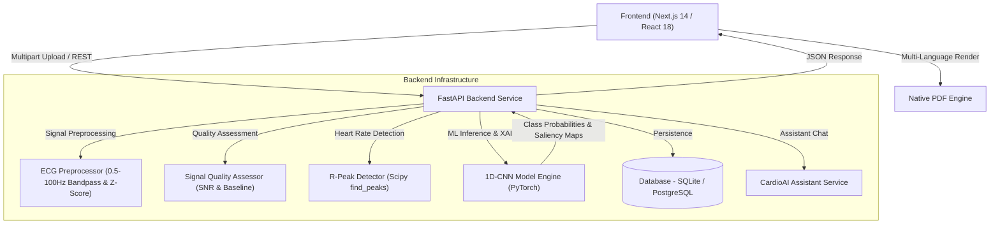

<div align="center">

  

  # CardioSense AI — AI-Assisted Cardiac Screening Platform
  **Early Detection of Cardiac Abnormalities Using Deep Learning & Explainable AI**

  ### 🏆 Team Name: **CODE BRO**

  

  <p align="center">
    <a href="https://nextjs.org/"></a>
    <a href="https://reactjs.org/"></a>
    <a href="https://tailwindcss.com/"></a>
    <a href="https://www.typescriptlang.org/"></a>
    <br/>
    <a href="https://fastapi.tiangolo.com/"></a>
    <a href="https://pytorch.org/"></a>
    <a href="https://www.sqlalchemy.org/"></a>
    <a href="https://www.python.org/"></a>
    <a href="LICENSE"></a>
  </p>

</div>

---

## 📌 Problem Statement

### **Early Detection of Cardiac Abnormalities Using AI**

> *"Cardiovascular diseases are one of the leading causes of death worldwide. Many heart rhythm disorders such as **Bradycardia**, **Tachycardia**, and **Arrhythmia** often remain undetected until they become severe because continuous cardiac monitoring requires expensive equipment and specialist interpretation. Millions of ECG and PPG recordings are generated every day, yet analyzing them manually is time consuming and prone to delays, especially in rural and resource-constrained healthcare settings."*

---

## 💡 Solution Overview

**CardioSense AI** bridges the gap between raw cardiac signals and clinical decisions by providing a multi-modal, explainable AI screening platform that works with standard ECGs, optical PPG sensors, and hospital hardware.

---

## 🌟 Key Platform Features

### 1. ⚡ Deep 1D-CNN AI Classification Engine
* Classifies cardiac signals into **Normal Sinus Rhythm**, **Bradycardia**, **Tachycardia**, and **Arrhythmias** with class confidence scores and Signal Quality Index (SQI).
* Powered by PyTorch 1D Convolutional Neural Network trained on PhysioNet WFDB benchmark datasets (MIT-BIH Arrhythmia Records 100, 101, 106, 200, 203).

### 2. 🧠 Explainable AI (XAI) Saliency Mapping
* Uses gradient-based saliency mapping to visually highlight the exact QRS/ST segments of the cardiac waveform that drove the AI prediction.
* Displays precise attention timeframes (e.g. `2.40s - 3.20s`) and clinical feature descriptions.

### 3. 🌐 Multilingual Support (8 Indian Regional Languages)
* Full real-time UI translation and PDF export support across 8 languages:
  * **English**, **Hindi (हिन्दी)**, **Tamil (தமிழ்)**, **Telugu (తెలుగు)**, **Gujarati (ગુજરાતી)**, **Marathi (मराठी)**, **Bengali (বাংলা)**, and **Kannada (ಕನ್ನಡ)**.

### 4. 📄 2-Page Clinical PDF Screening Generator
* Generates 100% Light Mode clinical hospital screening reports:
  * **Page 1:** Patient Demographics, Vitals, SQI Metrics, AI Classification, Class Probabilities %, and XAI Saliency Window.
  * **Page 2:** Full 10-second High-Resolution Waveform Graph, 7 Spacious Physician Handwritten Remarks Lines (`Line 1` to `Line 7`), Doctor Signature & Hospital Stamp Box, and Product Overview & Regulatory Warning Footer.

### 5. 🏥 Hospital Device Link (Web Serial API Oscilloscope)
* Connects directly to hardware ECG devices (AD8232 / Arduino / COM serial ports) via browser Web Serial API.
* Real-time 250 Hz digital oscilloscope stream with cardiac sound monitor and simulator mode.

### 6. 👨‍⚕️ Doctor Triage Workstation
* Multi-patient triage portal for physicians with 1-click **Approve AI** signature and clinical review note attachment.

### 7. 📊 PhysioNet Clinical Trial Exporter
* Anonymizes patient records (`SUBJ_XXXXXX`) and exports standardized CSV/JSON research datasets with SQI metrics.

### 8. 🎛️ Butterworth Bandpass DSP Filter Toggle
* Signal processing pipeline with 4th-order Butterworth bandpass filter (0.5 Hz – 40 Hz) and R-peak detection.

---

## 📊 Presentation & Demonstration Links

* **PPT Link:** [📊 View CardioSense AI Presentation](https://drive.google.com/file/d/1EtIglcMbS1xfX6V22JzN-JmA6a2fambD/view?usp=sharing)

* **🎥 Video Demonstration:** [Watch CardioSense AI Demo](https://drive.google.com/file/d/1yuJ_rHb-qcSAwdCfIRIucFGXGkXtjiEC/view?usp=sharing)

---

## 📚 Master System Documentation

Access the complete 12-feature clinical platform specification, 4-tier architecture breakdown, accuracy metrics, and India institutional market strategy:

* 📄 **PDF Format:** [📘 View Master Technical Documentation (PDF)](Documentation.pdf)
* 📝 **Word DOCX Format:** [📙 View Master Technical Documentation (DOCX)](Documentation.docx)

---

## 🛠️ Technology Stack

| Layer | Technologies Used |
| :--- | :--- |
| **Frontend Framework** | **Next.js 14 (App Router)**, **React 18**, **TypeScript** |
| **Styling & UI** | **Tailwind CSS**, **Lucide React SVG Icons**, **HTML5 Canvas 2D** |
| **Hardware & Web APIs** | **Web Serial API** (USB/Serial ECG), **Web Speech API** (Voice Reader), **Web Audio API** (Cardiac Monitor Beep) |
| **Backend API Service** | **Python 3.10+**, **FastAPI**, **Uvicorn**, **Pydantic v2** |
| **Machine Learning & DSP**| **PyTorch (1D-CNN)**, **SciPy** (Butterworth Filter & R-Peak Detection), **NumPy** |
| **Database & Auth** | **SQLite / SQLAlchemy ORM**, **PyJWT (JSON Web Tokens)**, **Bcrypt** |

---

## 👥 Team Members — **CODE BRO**

* **Tushar Jain** — Lead Frontend & Full-Stack Engineer ([@Tusharjain-19](https://github.com/Tusharjain-19))
* **Niranjan K** — Lead Backend & ML Architect ([@Niranjan-png](https://github.com/Niranjan-png))

---

## 🏗️ System Architecture



---

## ⚙️ Setup Instructions

### Prerequisites
- **Node.js**: v18.0+
- **Python**: v3.10+
- **Git**

### 1. Clone the Repository
```bash
git clone https://github.com/Tusharjain-19/cardiosense_ai.git
cd cardiosense_ai
```

### 2. Backend Setup (FastAPI & Python ML Engine)
```bash
cd backend

# Create virtual environment
python -m venv venv

# Activate virtual environment
# Windows (PowerShell):
.\venv\Scripts\Activate.ps1
# Linux / macOS:
# source venv/bin/activate

# Install dependencies
pip install -r requirements.txt

# Start FastAPI server
python -m uvicorn app.main:app --reload --port 8000
```
* **API Base URL:** `http://localhost:8000`
* **Swagger API Docs:** `http://localhost:8000/docs`

### 3. Frontend Setup (Next.js 14)
Open a new terminal window:
```bash
cd frontend

# Install dependencies
npm install

# Run Next.js dev server
npm run dev
```
* **Web App URL:** `http://localhost:3000`

---

## 🧪 Automated Testing

The backend includes a comprehensive pytest suite covering preprocessing, signal quality scoring, 1D-CNN inference, and REST API endpoints:

```bash
cd backend
python -m pytest tests/ -v
```

---

## ⚠️ Medical Disclaimer

**Important:** CardioSense AI is an AI-assisted screening and research prototype. Predictions, quality metrics, and reports generated by this application **do not constitute formal medical diagnosis** or clinical advice. The platform is designed to assist healthcare professionals in signal evaluation, not replace clinical judgment.

---

## 📜 License

This project is open-source and licensed under the **[MIT License](file:///d:/Cardiosense%20AI/LICENSE)**.

```text
Copyright (c) 2026 CODE BRO (Tushar Jain & Niranjan K)
```

Permission is hereby granted to use, copy, modify, and distribute this software for educational, research, and non-commercial/commercial screening demonstrations.

---

<div align="center">
  <p>&copy; 2026 <strong>Team CODE BRO</strong> — CardioSense AI. All rights reserved.</p>
</div>
